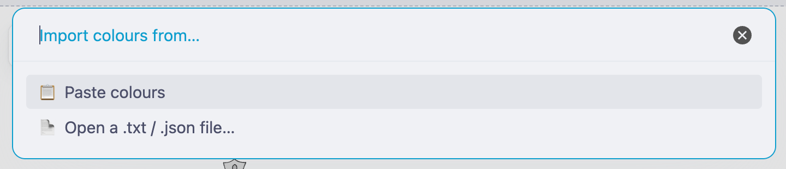
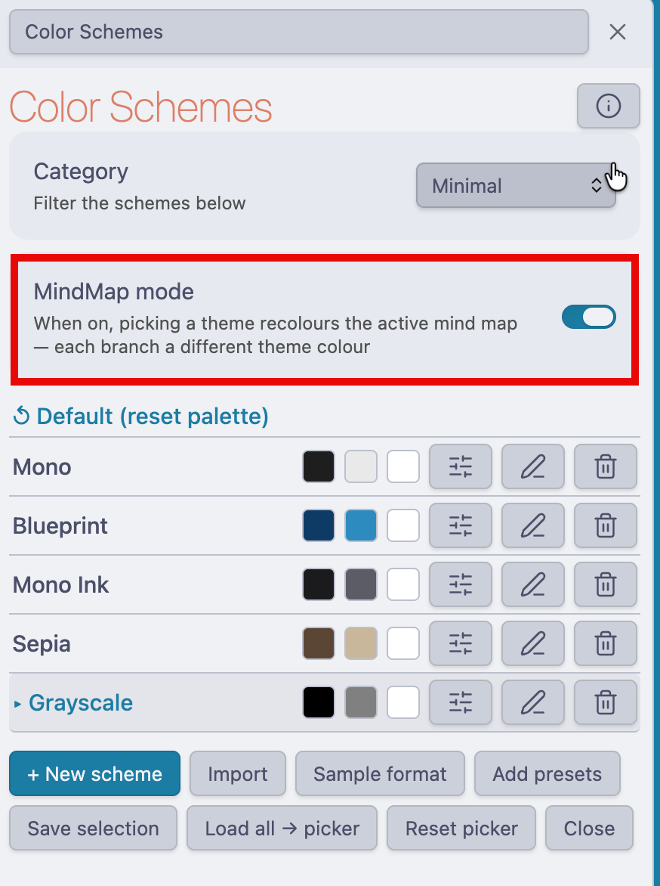

# Color Scheme Manager - Excalidraw Script

> ✅ **Now part of the official Excalidraw Script Engine library!** You can install it straight from the plugin's script store — no manual copying needed. Merged into [zsviczian/obsidian-excalidraw-plugin](https://github.com/zsviczian/obsidian-excalidraw-plugin) (see the [script index](https://github.com/zsviczian/obsidian-excalidraw-plugin/blob/master/ea-scripts/index-new.md#color-scheme-manager)).

An Obsidian Excalidraw script that swaps the entire **Stroke** and **Background/Fill** colour palettes of the active drawing between named, categorized themes — on the fly, from a docked side panel. Comes with a large built-in library (Cloud Providers, Code Editors, Tech Brands, Design Systems, and more) and lets you create or import your own.


## Features

- **Docked side panel** - Browse and apply schemes without leaving your drawing
- **Categorized library** - A **Category** dropdown filters ~60 built-in themes across 8 categories
- **Full 15-swatch palettes** - Every scheme populates the picker's extended grid (3×5) *and* the toolbar quick-pick rows, each swatch with a light→dark shade ramp
- **Stroke + Fill only** - Themes the element Stroke and Background/Fill palettes; the **canvas background is always left untouched (white)**
- **Smart apply** - With elements selected it recolours them; with nothing selected it sets the active stroke/fill for the next elements you draw
- **Create your own** - Pick two colours and a full 10-accent palette is auto-synthesized
- **Import** - Paste hex codes (e.g. a [Paletton](https://paletton.com) "as text" export) to build a scheme/theme instantly
- **Active indicator** - The currently applied scheme is highlighted with a ▸ marker (persists across reloads)
- **Reset** - A `↺ Default` entry restores Excalidraw's built-in palette
- **Persistent** - All schemes (built-in + custom) are saved in the plugin's script settings

## Installation

> Requires Excalidraw plugin **2.19.1** or higher.

There are two ways to install — pick whichever you like.

### Option 1 — Official Script Library (recommended)

Now that the script is part of the official library, install it from inside Obsidian — no files to copy:

1. Open any Excalidraw drawing.
2. Run **`Excalidraw: Install or update an Excalidraw script`** from the Command Palette (or use the Script Engine menu in Excalidraw).
3. Find **Color Scheme Manager** in the list and install it.

It's saved to your `Downloaded` scripts subfolder and appears in the scripts menu right away — and you can update it later from the same dialog.

### Option 2 — Manual

1. Download **both** files into your Excalidraw **Scripts folder** (set in the Excalidraw plugin settings):
   - [`Color Scheme Manager.md`](Color%20Scheme%20Manager.md) — the script
   - [`Color Scheme Manager.svg`](Color%20Scheme%20Manager.svg) — the icon (keep the **same name** next to the script)
2. Restart Obsidian or reload the Excalidraw plugin.
3. The script appears in the Excalidraw scripts menu.

## Usage

1. Open any Excalidraw drawing in Obsidian
2. Run **Color Scheme Manager** from the scripts menu (or the command palette) — a **Color Schemes** side panel docks open
3. Use the **Category** dropdown to filter the list
4. **Click a scheme's name** to apply it
5. **Reopen the colour picker** to see the refreshed extended grid (Excalidraw caches the open popover)

### What happens when you apply a scheme

| Context | Result |
|---------|--------|
| Elements selected | Their **stroke** and **fill** are recoloured |
| Nothing selected | The **active** stroke/fill is set for the next elements you draw |
| Always | The native picker (quick-pick rows + extended 3×5 grid) is repainted with the scheme's family |
| Never | The canvas background colour is left as-is |

## Built-in Library

| Category | Examples |
|----------|----------|
| **Cloud Providers** | Oracle Redwood, AWS, Microsoft Azure, Google Cloud, IBM Cloud, DigitalOcean, Alibaba Cloud |
| **Code Editors** | Nord, Dracula, Solarized, Monokai, Gruvbox, One Dark, Tokyo Night, Catppuccin, Ayu |
| **Tech Brands** | GitHub, Slack, Spotify, Discord, Stripe, Figma, Twitch, Netflix, Firefox, Notion |
| **Design Systems** | Material, Tailwind, Bootstrap, Fluent, Carbon, Ant Design |
| **Nature** | Ocean, Forest, Sunset, Autumn, Desert, Arctic, Coral Reef, Lavender |
| **Solids** | Teal, Amber, Crimson, Violet, Rose, Indigo, Emerald, Slate |
| **Vibrant** | Cyberpunk, Neon, Synthwave, Pastel, Candy, Tropical |
| **Minimal** | Mono, Mono Ink, Blueprint, Sepia, Grayscale |

## Panel Controls

| Control | Action |
|---------|--------|
| ℹ️ (top, next to title) | Toggle the **About** description |
| **Category** dropdown | Filter the list by category (your choice is remembered) |
| **+ New scheme** | Pick a stroke + fill, then choose a category; a full 10-accent palette is auto-synthesized |
| **Import** | Paste colours **or open a `.txt` / `.json` file**, then choose a category (2 = stroke+fill, 6+ = a full theme) |
| **Sample format** | Download a template `.txt` showing exactly what Import expects |
| **Export palette** | Save the drawing's current picker palette as appState JSON (clipboard + Downloads) — re-importable via Option C |
| **Add presets** | Pull in any built-in themes you don't already have |
| **Save selection** | Capture the stroke/fill of the currently selected element as a new scheme |
| **Load all → picker** | Load every saved scheme's colours into the picker at once |
| **Reset picker** | Restore Excalidraw's default palette |
| 🎚️ (per row) | **Customize picker** — hand-pick the exact swatches, order, and top-picks |
| ✎ (per row) | Rename **and/or** change the scheme's category |
| 🗑 (per row) | Delete the scheme (asks for confirmation) |
| `↺ Default` row | Reset the picker to Excalidraw defaults |

## Adding your own schemes

There are three ways to add a scheme — each one then prompts you for a category:

- **+ New scheme** — choose a stroke and a fill in the native colour pickers. The script builds a coherent 10-accent family (analogous hues + tonal range) so you still get the full 15-swatch grid.
- **Import** — **paste** colours or **open a `.txt` / `.json` file**, in either a simple flat list (script derives stroke/fill) or the labelled `STROKE:`/`FILL:` format for full control. Works directly with a [Paletton](https://paletton.com) "as text" export or the downloaded Sample format file. See **Import format** below.
- **Save selection** — select a styled element on the canvas, then click *Save selection* to capture its stroke and fill.

### Import format

Click **Sample format** in the panel to download a ready-to-edit template (`color-scheme-import-sample.txt`). Then **Import** lets you either **📋 paste** the colours or **📄 open a `.txt` / `.json` file** (e.g. the template you just edited, or a saved palette file) — both run through the same parser. There are **three formats** you can use.

Ready-made example files in this folder (download → **Import → Open a .txt / .json file…**):
- [`sample-color-scheme-import.txt`](sample-color-scheme-import.txt) — labelled STROKE/FILL format (Option B)
- [`sample-color-palette-appstate.json`](sample-color-palette-appstate.json) — raw appState palette (Option C)



**Stroke / Fill / Canvas** map to Excalidraw's three colour pickers. In this script the **canvas background is always white and not editable**, so you only ever define **stroke** and **fill**. Each picker grid holds up to **15 swatches = 3 rows × 5 columns** (the first 5 you list are row 1, the next 5 row 2, the next 5 row 3), and every swatch gets an automatic light→dark shade ramp.

Hex is 6 digits, the leading `#` is optional, and `transparent` / `black` / `white` are allowed as names.

#### Option A — Simple (one flat list)

Paste a single list; the script derives stroke and fill for you.

- **2–5** colours → a scheme (1st = stroke, 2nd = fill), auto-expanded to 15.
- **6+** colours → a theme (first 10 used). Stroke = your colours + dark shades; Fill = lighter tints.

```text
5E81AC 81A1C1 88C0D0 8FBCBB A3BE8C B48EAD BF616A D08770 EBCB8B 4C566A
```

#### Option B — Full control (labelled stroke + fill)

📥 **Ready-made example:** [`sample-color-scheme-import.txt`](sample-color-scheme-import.txt) — download it, then **Import → 📄 Open a .txt / .json file…** and pick it.

Label each picker explicitly. `STROKE:` and `FILL:` take up to 15 colours each (3×5); `TOPPICKS_*` are the 5 quick swatches shown before the grid opens (optional). `NAME:` and `CATEGORY:` are optional (you'll be prompted if omitted).

```text
NAME: My Full Theme
CATEGORY: Custom

# STROKE picker — 15 colours = 3 rows x 5 columns
STROKE:
1E1E1E 5E81AC 81A1C1 88C0D0 8FBCBB
A3BE8C B48EAD BF616A D08770 EBCB8B
4C566A 2E3440 3B4252 434C5E D8DEE9

# FILL picker — 15 colours = 3 rows x 5 columns
FILL:
transparent D8DEE9 E5E9F0 ECEFF4 C0D0E0
CFE8CF E8D6E8 F4C7C3 F5D9C8 F7ECC9
EBEEF3 C2C9D6 CDD3DE D6DBE5 B9C2D0

# Quick-pick rows — 5 colours each (optional)
TOPPICKS_STROKE: black 5E81AC BF616A A3BE8C EBCB8B
TOPPICKS_FILL: transparent E5E9F0 F4C7C3 CFE8CF F7ECC9
```

#### Option C — Raw appState palette (JSON)

📥 **Ready-made example:** [`sample-color-palette-appstate.json`](sample-color-palette-appstate.json) — download it, then **Import → 📄 Open a .txt / .json file…** and pick it.

For maximum fidelity you can paste/import a raw Excalidraw **`colorPalette`** object straight from a drawing's `appState` — either the bare palette or an object with a `colorPalette` key. It's loaded **verbatim**: every swatch keeps its exact shade ramp and the `topPicks` rows are preserved, with no regeneration.

**Where do you get it?** Click **Export palette** in the panel — it grabs the drawing's *current* `appState.colorPalette`, copies it to the clipboard, and downloads `color-palette-appstate.json`. (Apply a scheme first so there's a palette to export.) You can then edit that JSON and re-import it here, or share it.

```json
{
  "colorPalette": {
    "elementStroke": [ "transparent", "black", ["#B2B0B0","#8B8988","#323131","#191918","#646261"], … ],
    "elementBackground": [ … ],
    "canvasBackground": [ … ],
    "topPicks": {
      "elementStroke": ["#755941","#006666","black","#CECDCC","transparent"],
      "elementBackground": ["#FFF6F0","#E6D2C1","#99DEDE","#CECDCC","transparent"],
      "canvasBackground": ["#FFF6F0","#AF9178","#002C2C","#CECDCC","#646261"]
    }
  }
}
```

> Unlike the other formats (which keep the canvas white), a raw appState palette is applied exactly as given — including its `canvasBackground` and `topPicks`.

## Customizing the picker

If you don't want *all* of a scheme's colours loaded, or want a different order than the auto-generated one, click the **🎚️** button on a scheme row to open the **Customize picker** editor. It works on any scheme (built-in or your own) and edits four lists:

- **Stroke grid** and **Fill grid** — up to 15 swatches each (3 rows × 5).
- **Stroke top-picks** and **Fill top-picks** — the 5 quick swatches shown before the grid opens.

In each list you can:

- **+ Add colour** via Excalidraw's native picker,
- **click a swatch** to change it,
- **drag the ⠿ handle** to reorder (drag-and-drop),
- **✕** to remove.

A live preview strip shows each list as you edit.

- **Save** stores the exact spec on the scheme (so applying it loads precisely those colours, in that order).
- **↺ Revert to default** restores a built-in scheme's original colours (stroke / fill / accents) and clears the custom picker — the clean way to undo edits. (For your own schemes, it just clears the picker.)
- **Load from theme…** copies any other theme's default colours into the editor as a starting point.

The canvas background always stays white.

> Tip: the labelled **Import** format (Option B above) writes the same spec — the editor is just the visual way to do it.

## MindMap Builder integration

If the **[MindMap Builder](https://github.com/zsviczian/obsidian-excalidraw-plugin)** script (v26.06.02+) is also installed, you can recolour your mind maps straight from here.

When its API is available, the panel shows a **MindMap mode** toggle. **This toggle only appears if the MindMap Builder script is installed and its API is ready** (`window.MindMapBuilderAPI.ready()`) — with the MindMap script absent, nothing shows and the panel stays clean for standalone use. It **always starts OFF** on each script load (it isn't persisted) — recolouring a mind map is a deliberate, opt-in action.



- **MindMap mode OFF** — standalone behaviour: clicking a scheme recolours your selection / sets the active colour as usual. Mind map elements are **always left untouched**, even if the MindMap plugin keeps the root node selected (they're excluded from the selection recolour).
- **MindMap mode ON** — clicking any scheme recolours the **entire active map**, giving **each first-level branch (and its connector line + subtree) a different colour** from the scheme's palette. **No canvas selection needed**, and it does *not* uniformly repaint everything.

A notice is shown only when you flip the toggle on/off — recolouring on each theme change is silent.

How it works: the script reads the map structure from the MindMap Builder API (`getMindMapRoots` → `getElementIdsByRole` → `getMapInfo` for depth → `getBranchElementIds` per first-level branch), then recolours each branch's elements directly with ExcalidrawAutomate. Branch colours are **sorted by hue and interleaved** so neighbouring branches look as different as possible (many themes list their accents hue-adjacent). Connector lines are coloured by the branch they point into (via the arrow's bindings). It also sets the global `customPalette` so newly-added branches stay on theme.

- Branch colours come from the scheme's accents (or your custom picker's stroke list), with `transparent` / `black` / `white` dropped.
- The centre/root node takes the scheme's primary stroke; each branch subtree shares one palette colour, and successive branches step across the colour wheel.
- Single-hue themes (the *Solids* category) only offer variations of one hue — use a multi-colour theme or custom scheme for maximum branch variety.

## Categories

- The **Category** dropdown at the top filters which schemes are shown.
- Built-in themes ship with a fixed category (Cloud Providers, Code Editors, etc.). New and imported schemes default to **Custom**.
- **Assign a category** when creating/importing (pick an existing one or choose **＋ New category…** to type a brand-new name), or change it later with the **✎** button on any row — this works on built-in themes too.
- A category exists only while at least one scheme uses it. **Move or delete the last scheme in a category and that category disappears from the dropdown** automatically — there is no separate "delete category" step.

## Deleting

- Click the **🗑** on a row to delete that scheme (you'll be asked to confirm).
- Deleting a **built-in** theme is fine — it will **not** be re-added on the next run (a version flag tracks the one-time merge of built-ins).
- To wipe everything and start over, delete the `Color Scheme Manager` entry under `scriptEngineSettings` in `data.json` (see below) while Obsidian is closed; the built-ins will be re-seeded on next run.

## Where schemes are stored

All schemes (built-in and custom) live together in the plugin's script settings:

```
.obsidian/plugins/obsidian-excalidraw-plugin/data.json
  → scriptEngineSettings → "Color Scheme Manager" → "Saved Schemes (JSON)"
```

Back up or move that value to transfer your library.

## Tips

- The colour picker caches while open — **close and reopen it** to see a newly applied palette.
- The first cell of each picker stays **transparent**; **black** and **white** are kept as fixed anchors. Every other swatch is theme-derived.
- Press **Escape** to cancel any prompt.
- Use the ℹ️ button at the top of the panel for a quick in-app description.

## License

MIT License
