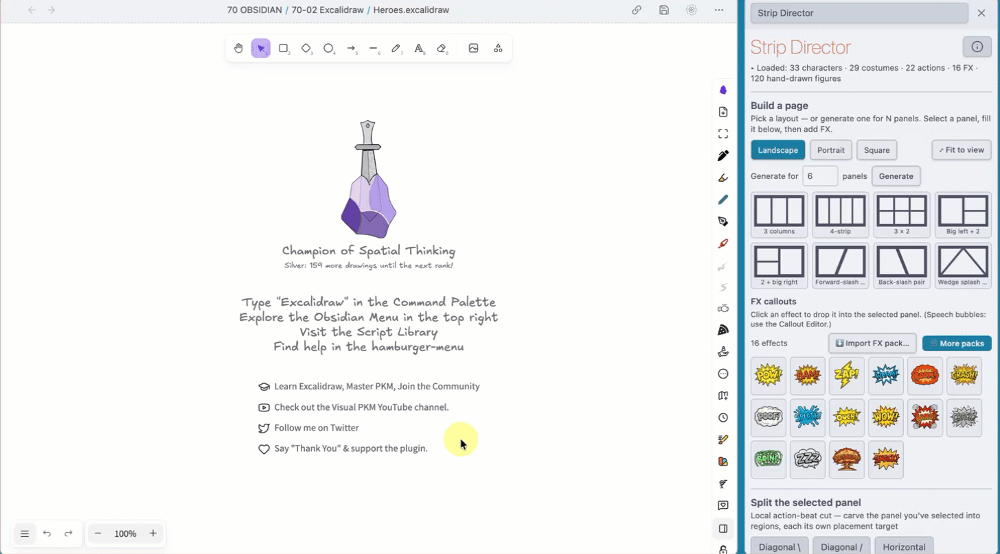
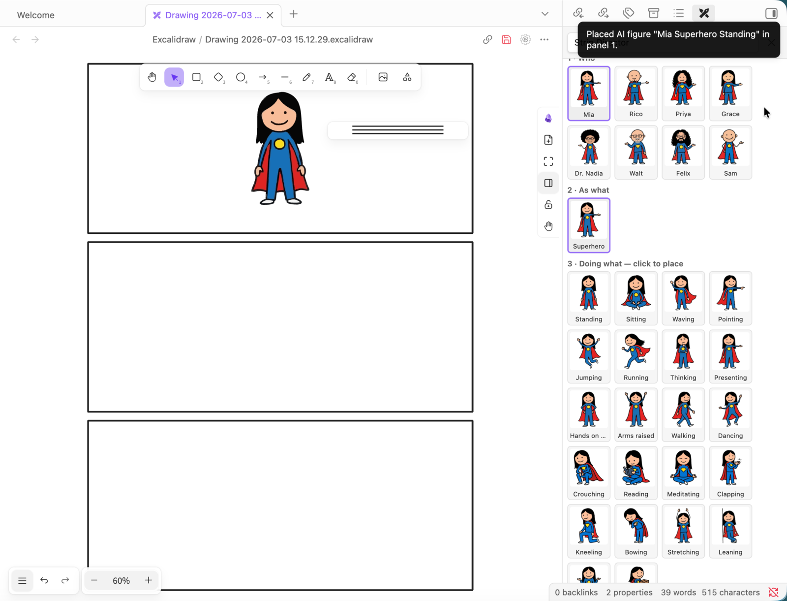
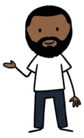

# Comic Strip Director

An Excalidraw Script Engine script that turns the Obsidian + Excalidraw canvas into a
comic-strip studio: drop a panel layout, fill the panels with hand-drawn characters in
any costume and pose, then punch it up with painted sound-effect FX — no drawing
skills required.

**The free tier is one click away**: the 8-character Core Cast (176 poses), all 30
panel layouts, and 3 painted FX (POW! BOOM! ZAP!) install via the **⭐ Get the free
starter pack** button inside the script. More characters, costumes, themes and the
full FX set: **[comicstripdirector.com](https://comicstripdirector.com/)**.

## Install & get started (TL;DR)

1. **Get the script** — for the latest version, download **Comic Strip Director**
   from the official Excalidraw script library (Obsidian → Excalidraw →
   **script store**). *Manual alternative:* copy the two files from this folder —
   `Comic Strip Director.md` and `Comic Strip Director.svg` — into
   `<Excalidraw>/Scripts`.
2. **Open Comic Strip Director** — open a drawing and run it from the Excalidraw
   script menu.
3. Click **⭐ Get the free starter pack** at the top of the panel. This creates the
   required data folder AND downloads the free images from GitHub straight into the
   script — Core Cast (8 characters, every action) plus the POW!/BOOM!/ZAP! FX,
   with a progress bar.
4. **Download additional packs** from **[comicstripdirector.com](https://comicstripdirector.com/)**.
5. **Place the `.strippack` files** in `<Excalidraw>/Scripts` or
   `<Excalidraw>/Scripts/Downloaded`.
6. **Import them in the script** with the **⬇ Import pack…** / **⬇ Import FX pack…**
   buttons — every `.strippack` in those two folders shows up, and you can import
   them **all at once** (checkbox list). The script only accepts `.strippack` files
   (no `.zip`s) to avoid confusion — unzip the product download first.
7. **Start creating your comics!**

> [!WARNING]
> **Using Obsidian Sync?** Exclude the data folder
> `<Excalidraw>/Scripts/Comic Strip Director` from sync (older installs:
> `Comicbook Strip Director (Library)`). Imported packs contain a **lot** of
> images — they can eat your Obsidian Sync space and make Obsidian slower.

> [!TIP]
> After importing a strip pack, **close and reopen Obsidian** so file indexing can
> do a good job.

### Extras

- [`free/core-free.strippack`](free/core-free.strippack) /
  [`free/comic-fx-free.strippack`](free/comic-fx-free.strippack) — the free tier as
  plain pack files (what the ⭐ starter button downloads for you) — for offline /
  manual installs: copy them into the scripts folder **with Finder / Explorer**
  (drag-dropping onto the Obsidian window silently ignores unknown file types),
  then **⬇ Import pack…**.
- [`free/layouts-free.zip`](free/layouts-free.zip) — the 30 page templates as
  standalone SVG + PNG, for use in *other* tools (Miro, Google Drawings, Figma, …).
  The script itself has all 30 built in.

## Meet the free Core Cast

Eight hand-drawn characters, preinstalled and ready to pose — each available in all
22 actions, and dressable in any costume pack you add later.

<table>
<tr><td align="center"> <b>Mia</b></td><td align="center"> <b>Walt</b></td><td align="center"> <b>Priya</b></td><td align="center"> <b>Sam</b></td></tr>
<tr><td align="center"> <b>Dr. Nadia</b></td><td align="center"> <b>Rico</b></td><td align="center"> <b>Grace</b></td><td align="center"> <b>Felix</b></td></tr>
</table>

## The extended cast — available at [comicstripdirector.com](https://comicstripdirector.com/)

Twenty-five more characters (not included in the free tier), each sold as a full pack
with every pose and costume-ready. Costume/theme packs and the full 16-effect FX set
are on the site too.

<table>
<tr><td align="center"> Marcus</td><td align="center"> Yuki</td><td align="center"> Diego</td><td align="center"> Zara</td><td align="center"> Ingrid</td></tr>
<tr><td align="center"> Kofi</td><td align="center"> Sven</td><td align="center"> Amara</td><td align="center"> Hassan</td><td align="center"> Lola</td></tr>
<tr><td align="center"> Theo</td><td align="center"> Nia</td><td align="center"> Sakura</td><td align="center"> Malik</td><td align="center"> Elena</td></tr>
<tr><td align="center"> Bruno</td><td align="center"> Mei</td><td align="center"> Otto</td><td align="center"> Rosa</td><td align="center"> Jin</td></tr>
<tr><td align="center"> Fatima</td><td align="center"> Gus</td><td align="center"> Anaïs</td><td align="center"> Tariq</td><td align="center"> Willa</td></tr>
</table>

## Features

- **Visual layout picker** — 30 named panel templates (grids, manga tiers, dynamic
  angled gutters, splash pages) in landscape / portrait / square, plus a parametric
  generator for any panel count. Each new page stacks below the previous one.
- **Polygon panels** — angled / diagonal / wedge pages, not just rectangular grids.
- **Split the selected panel** — local diagonal / horizontal action-beat cuts; each
  region is its own placement target.
- **Character system** — place characters by *who × costume × action*. The picker
  shows only combinations from the packs you own, every tile with a real thumbnail,
  plus per-character show/hide (**⚙ Manage**).
- **Pack import** — install `.strippack` character and FX add-on packs. Imports are
  idempotent and de-duplicated, and index files are backed up before every merge.
- **Painted FX callouts** — POW! BOOM! ZAP! stamped straight into the selected panel,
  crisp SVG preferred automatically.
- **Reserved callout zones** — composes with the
  [Comicbook Callout Editor](https://github.com/zsviczian/obsidian-excalidraw-plugin/blob/master/ea-scripts/Comicbook%20Callout%20Editor.md)
  for speech bubbles (never touches its data).

Everything the script draws is tagged `customData.stripDirector`; it never modifies
`comicCallout`.

## License

The script is MIT-licensed (see [LICENSE](LICENSE)). The bundled free content
(characters, layouts, FX) may be used freely in your own comics, personal or
commercial; redistribution or resale of the content packs themselves is not permitted.
