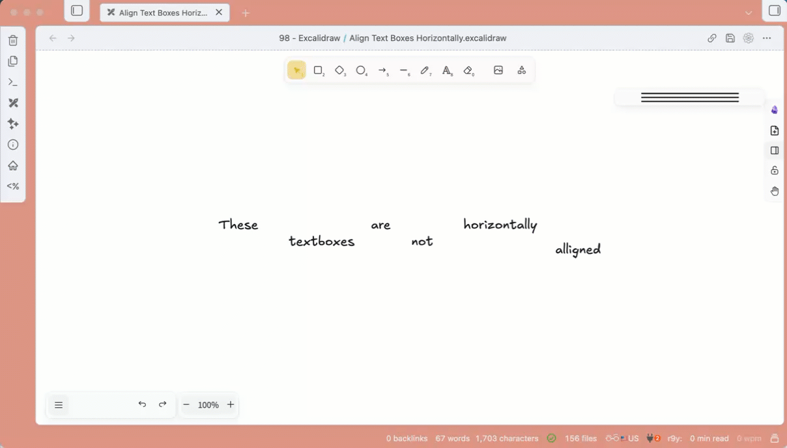

# Align Text Boxes Horizontally (Obsidian Excalidraw Script)

This Obsidian Excalidraw Script aligns multiple text boxes onto the same horizontal line. Perfect for creating clean, organized diagrams, flowcharts, and visual notes where text elements need to be precisely aligned.

## Features

- **Top Alignment** — Aligns all text boxes to the topmost element's Y position
- **Middle Alignment** — Aligns all text boxes to the vertical center of the selection
- **Bottom Alignment** — Aligns all text boxes to the bottommost element's position
- **First Selected Alignment** — Aligns all text boxes to match the first selected element's vertical center

## Usage

1. Open an Excalidraw drawing
2. Select **two or more** text elements you want to align
3. Run the script from the Excalidraw Scripts menu
4. Choose your preferred alignment option from the popup menu:
   - `Top` — align top edges
   - `Middle` — align vertical centers
   - `Bottom` — align bottom edges
   - `First Selected` — align to the first element you selected

## How It Works

The script calculates the bounding box of all selected text elements and repositions them based on your chosen alignment:

| Alignment | Behavior |
|-----------|----------|
| Top | All elements move to match the highest Y coordinate |
| Middle | All elements center on the average vertical position |
| Bottom | All elements move to match the lowest Y coordinate |
| First Selected | All elements align to the first selected element |

## Installation

1. Download `Align Text Boxes Horizontally.md`
2. Place it in your Excalidraw scripts folder:
   - Default location: `YourVault/Excalidraw/Scripts/`
3. Restart Obsidian or reload Excalidraw
4. The script will appear in the Excalidraw Scripts menu

## Pro Tips

- **Assign a hotkey** — For faster workflow, assign a keyboard shortcut to this script in Obsidian's Hotkeys settings
- **Selection order matters** — When using "First Selected" alignment, the element you click first becomes the reference point
- **Combine with other scripts** — Use this alongside distribution scripts to create perfectly aligned and evenly spaced layouts

## Requirements

- [Obsidian](https://obsidian.md/)
- [Excalidraw Plugin](https://github.com/zsviczian/obsidian-excalidraw-plugin)

## License

MIT License

